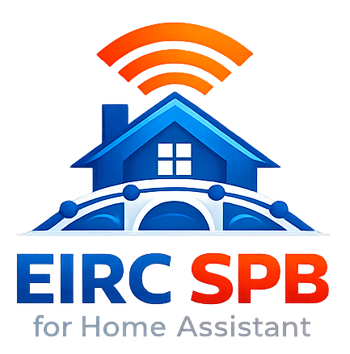

# EIRC SPB Integration for Home Assistant


[](https://github.com/hacs/integration)

<p align="center">
  
</p>

The EIRC SPB Integration allows you to connect your Home Assistant instance to the Saint Petersburg Unified Information
and Settlement Center (EIRC SPB), providing access to personal account details from the customer portal. This
integration supports authentication by email or phone number, including additional confirmation methods when required,
and creates sensor entities from the account detail blocks available in the API.

## Installation

Installation is easiest via the [Home Assistant Community Store
(HACS)](https://hacs.xyz/), which is the best place to get third-party
integrations for Home Assistant. Once you have HACS set up, simply click the button below (requires My Home Assistant
configured) or
follow the [instructions for adding a custom
repository](https://hacs.xyz/docs/faq/custom_repositories) and then
the integration will be available to install like any other.

[](https://my.home-assistant.io/redirect/hacs_repository/?owner=OddanN&repository=eirc_spb_for_home_assistant&category=integration)

## Configuration

After installing, you can configure the integration using the Integrations UI. No manual YAML configuration is required.
Go to Settings / Devices & Services and press the Add Integration button, or click the shortcut button below (requires
My Home Assistant configured).

[](https://my.home-assistant.io/redirect/config_flow_start/?domain=eirc_spb_for_home_assistant)

### Setup Wizard

- **Sign in with email**: Enter your EIRC SPB email and password.
- **Sign in with phone**: Enter your phone number in `+79991234567` format and your password.
- **Additional confirmation**: If required by the EIRC SPB API, the integration supports confirmation by email code,
  phone code, or flash call.

After successful authentication, the integration stores your account session and creates a config entry.

### Integration Options

- **Update Interval**: Set the polling interval in hours. Default is 12 hours, minimum is 1 hour, maximum is 12 hours.
- **Accounts**: Choose which personal accounts should be tracked in Home Assistant.

If the API requires reauthentication later, Home Assistant will prompt you to confirm the session again.

## Usage

### Entities

Once configured, the integration creates one device per selected personal account and generates sensor entities from the
living premises account detail block returned by the EIRC SPB API.

Entity IDs are generated automatically from the account, block name, and field name. For example:

- `sensor.<generated_entity_id>`: A sensor for a field from the personal account details.

Each generated sensor:

- Uses the field name from EIRC SPB as the entity name.
- Returns the current field value as the sensor state.
- Includes extra attributes such as:
  - `last_update`: Timestamp of the last successful refresh.
  - `block_header`: Source block header from the API.
  - `real_value`: Original raw value from the API.
  - `description`: Field description, if provided by the API.
  - `code`: Source field code, if provided by the API.

Typical examples depend on the account payload returned by EIRC SPB and may include values related to the living
premises.

### Example Automation

Create an automation to notify you when a selected EIRC SPB sensor changes:

```yaml
automation:
  - alias: EIRC SPB Sensor Change Alert
    trigger:
      platform: state
      entity_id: sensor.<generated_entity_id>
    action:
      - service: notify.mobile_app_<your_device>
        data:
          message: >
            EIRC SPB sensor {{ trigger.to_state.name }} changed to
            {{ trigger.to_state.state }}.
```

## Notes

- This integration requires an active EIRC SPB account.
- Data is fetched from the EIRC SPB customer API at `https://ikus.pesc.ru`.
- Only selected personal accounts are created as devices and refreshed by the coordinator.
- The current version exposes sensor entities only.
- For support or to report issues, please open an issue on
  the [GitHub repository](https://github.com/OddanN/eirc_spb_for_home_assistant/issues).

## Debug

For DEBUG add to `configuration.yaml`

```yaml
logger:
  default: info
  logs:
    custom_components.eirc_spb_for_home_assistant: debug
```

## License

This project is licensed under the MIT License. See the [LICENSE](LICENSE) file for details.
